# 逆水寒幫會管理平台｜操作手冊

版本：2026/10/05 · 第 3 版（新增管理出勤閱覽與取消請假）

適用於目前本機程式與對應的 GAS 版本；GAS 網頁實際可用功能以已發布的部署版本為準。

本手冊說明日常操作。圖片取自最新版程式的隔離示範環境；角色、UID、場次、影片連結與戰績數字均為示範，並非正式幫會資料。左上角名稱與圖示可由 admin 調整，因此你的畫面可能顯示不同幫會名稱。

## 目錄

1. [身分與功能](#roles)
2. [登入與返回首頁](#login)
3. [行事曆與選擇場次](#calendar)
4. [報名、請假與職業統計](#participation)
5. [提交影片連結](#video-upload)
6. [閱覽影片與匯出 CSV](#video-view)
7. [成員清單與編輯](#members)
8. [批次匯入成員](#member-import)
9. [建立、修改與刪除活動](#events)
10. [安排戰場名單](#lineups)
11. [雙場換人、職責與備註](#lineup-position)
12. [排表儲存、範本與 JPG](#lineup-save)
13. [上傳戰績 CSV](#battle-upload)
14. [戰績清單與對戰詳情](#battle-view)
15. [個人戰績分析](#personal)
16. [admin 帳號與平台設定](#admin)
17. [手機操作](#mobile)
18. [常見問題](#faq)

<a id="roles"></a>
## 1. 身分與功能

| 功能 | 未登入 | member 成員 | manager 管理者 | admin |
| --- | --- | --- | --- | --- |
| 查看一般活動、約戰 | 可以 | 可以 | 可以 | 可以 |
| 查看幫戰、龍虎戰 | 不可以 | 可以 | 可以 | 可以 |
| 約戰報名／請假、提交影片 | 可以 | 可以 | 可以 | 可以 |
| 幫戰／龍虎戰報名、請假、提交影片 | 不可以 | 可以 | 可以 | 可以 |
| 戰績閱覽、已關聯的個人數據 | 不可以 | 可以 | 可以 | 可以 |
| 成員、活動、排表、戰績上傳 | 不可以 | 不可以 | 可以 | 可以 |
| 出勤閱覽、取消請假 | 不可以 | 不可以 | 可以 | 可以 |
| 影片清單、篩選、匯出 CSV | 不可以 | 不可以 | 可以 | 可以 |
| 帳號與平台設定 | 不可以 | 不可以 | 不可以 | 可以 |

member 使用共用通行密碼，不需要輸入帳號。manager／admin 使用各自帳號及密碼。填入角色名稱不代表系統已驗證你是該角色本人；請填寫正確名稱。

<a id="login"></a>
## 2. 登入與返回首頁

1. 點右上角「登入」。預設開啟「成員登入」。
2. 一般成員填入 admin 提供的通行密碼，按「登入」。通行密碼區分大小寫。
3. 管理者切到「管理者登入」，填帳號與密碼後登入。
4. 使用完畢可按右上角「登出」。點左上角幫會名稱可返回行事曆首頁。

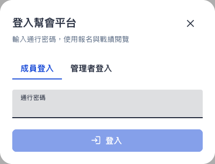

圖 1：成員登入，帳號由系統處理。

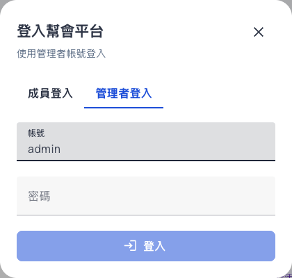

圖 2：管理者登入。圖片中的 admin 僅為示範帳號；手冊不提供任何正式密碼。

<a id="calendar"></a>
## 3. 行事曆與選擇場次

1. 首頁直接顯示行事曆。用月份左右箭頭切換月份，「今天」回到目前月份。
2. 點有安排的日期格，開啟當天場次清單。
3. 同一天有多場時，選正確的場次，再按「報名／請假／影片」。每場的回應各自保存。

未登入時只有一般活動與約戰；登入 member／manager／admin 後才會出現幫戰與龍虎戰。一般活動沒有戰鬥報名或影片表單。

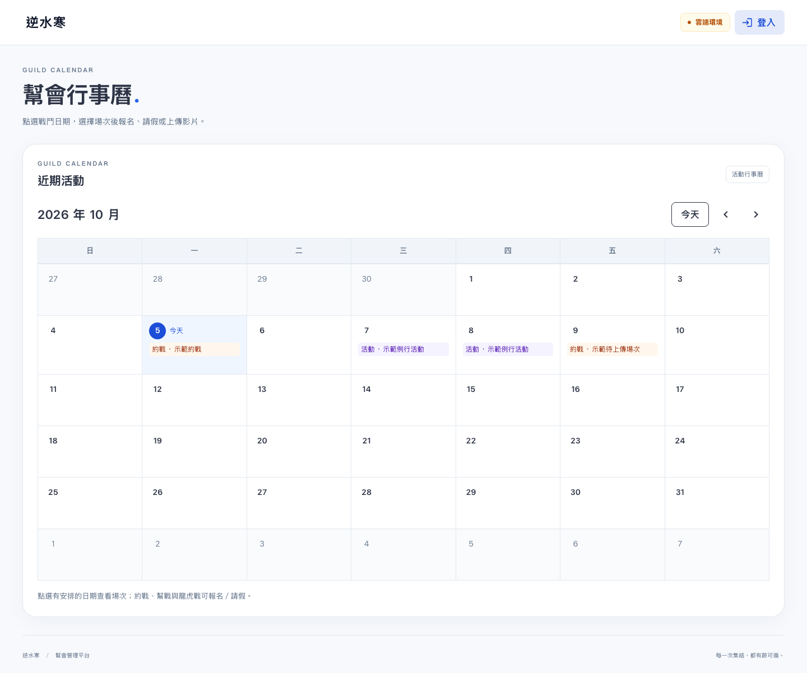

圖 3：未登入時的可見場次。

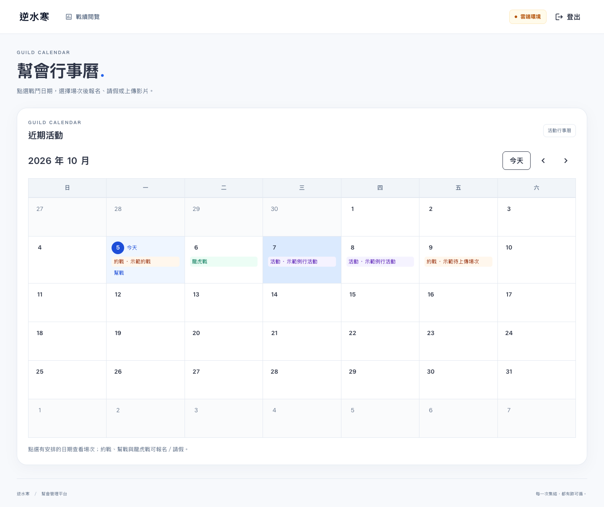

圖 4：登入後會增加幫戰、龍虎戰，日期格的筆數也隨可見場次更新。

<a id="participation"></a>
## 4. 報名、請假與職業統計

**報名**：選「報名」，填角色名稱、上場職業及選填備註，再按「送出報名」。幫戰／龍虎戰另提供「直接輸入名稱」「幫會成員名單」「龍虎戰成員名單」三種名稱來源；從名單選人會帶入主職業，仍可調整本場職業。

**請假或取消報名**：狀態改成「請假」，輸入原報名名稱或選擇名冊成員，再按「送出請假」。請假不要求職業。額外報名者想取消，也使用請假。

成功後會顯示「報名成功」或「請假成功」。幫會／俱樂部成員可直接請假；編外或外援須已有本場資料。找不到對象時顯示「沒有報名或沒有資料」。同名無法辨識時，幫戰／龍虎戰可從成員名單選擇，或請管理者協助。

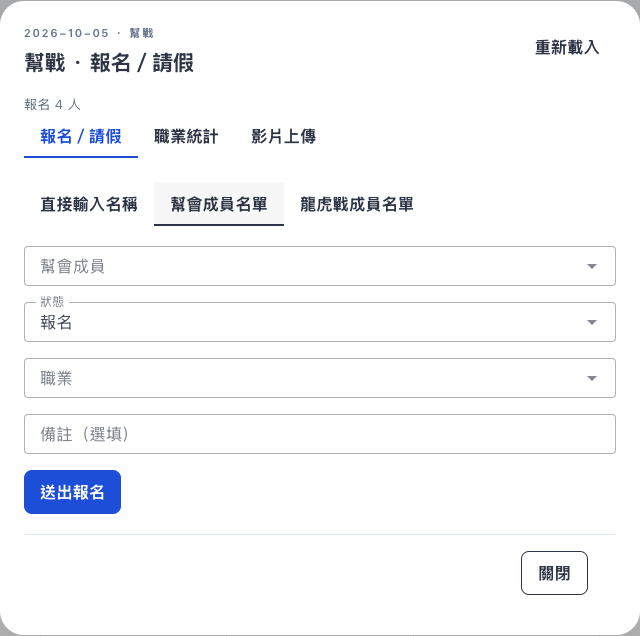

切到「職業統計」可查看本場各職業的有效報名人數。這裡只統計已報名的人，請假不計入；它不是幫會全員或已排表人數。切換分頁會保留未送出的輸入。

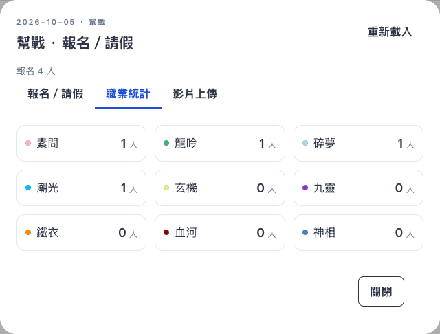

<a id="video-upload"></a>
## 5. 提交影片連結

在同一場次視窗切到「影片上傳」，依序填寫：

1. 角色名稱。
2. 第一場網址，選填。
3. 第二場網址，選填。
4. 團別：進攻一／進攻二／防守團。
5. 備註，選填，最多 500 字。
6. 按「送出」，等待「影片連結上傳成功」。

兩個網址至少填一個，使用完整的 http 或 https 連結。這裡保存的是影片網址；請先將影片放到自己的影片平台。同一角色可以送出多次，每次成功提交都保留一筆，請確認連結正確再送出。提交影片不會自動報名。

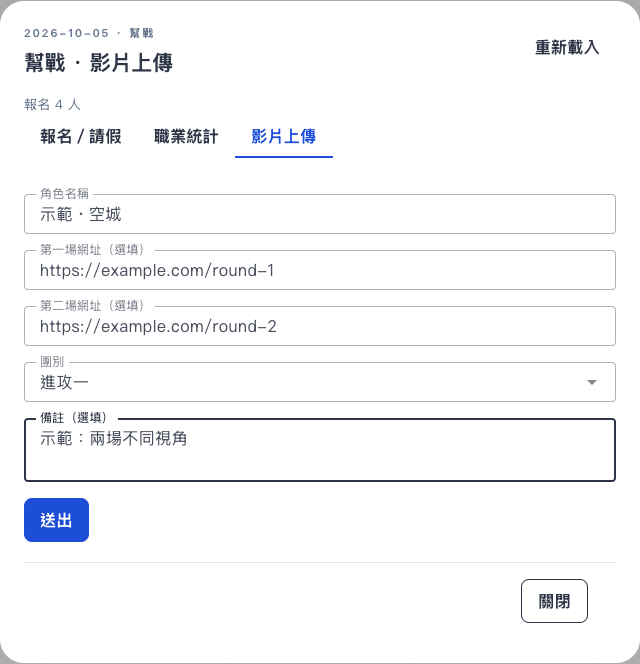

<a id="video-view"></a>
## 6. 閱覽影片與匯出 CSV

此頁僅供 admin／manager，member 無法查看清單。

1. 從導覽開啟「影片閱覽」，選擇戰鬥場次。
2. 用「搜尋角色名稱」或「團別篩選」縮小清單，兩者可同時使用。
3. 表格顯示角色名稱、第一場連結、第二場連結、團別及備註。網址是可選取複製的文字；要觀看時自行複製至瀏覽器。
4. 按「匯出 CSV」，下載**目前篩選後表格的全部資料**，不包含其他場次。沒有符合資料時不能匯出。

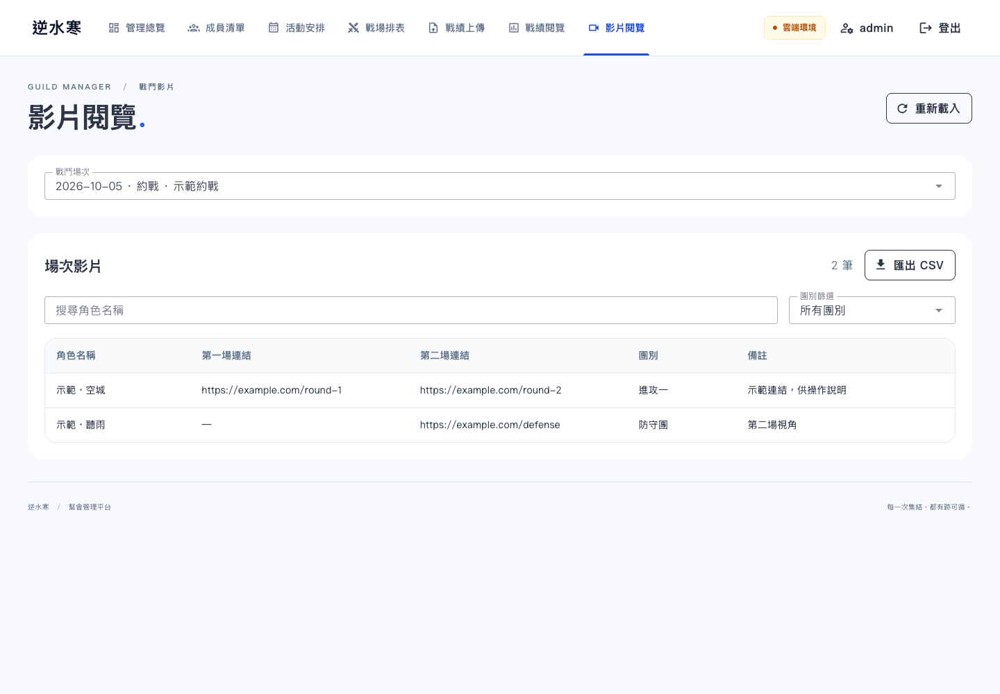

CSV 使用 UTF-8，可用 Google 試算表或 Excel 開啟。資料更新時按「重新載入」；重複名稱可能代表同一人分次提交，不會被合併。

<a id="members"></a>
## 7. 成員清單與編輯

admin／manager 從「成員清單」管理名冊。

- **成員**：幫派內或俱樂部內至少一個為「是」。
- **編外人員**：兩個所屬狀態均為「否」。
- 可搜尋 UID、目前名稱或過去名稱，並同時篩選主職業、副職業及幫派／俱樂部。副職業可選「無副職業」。

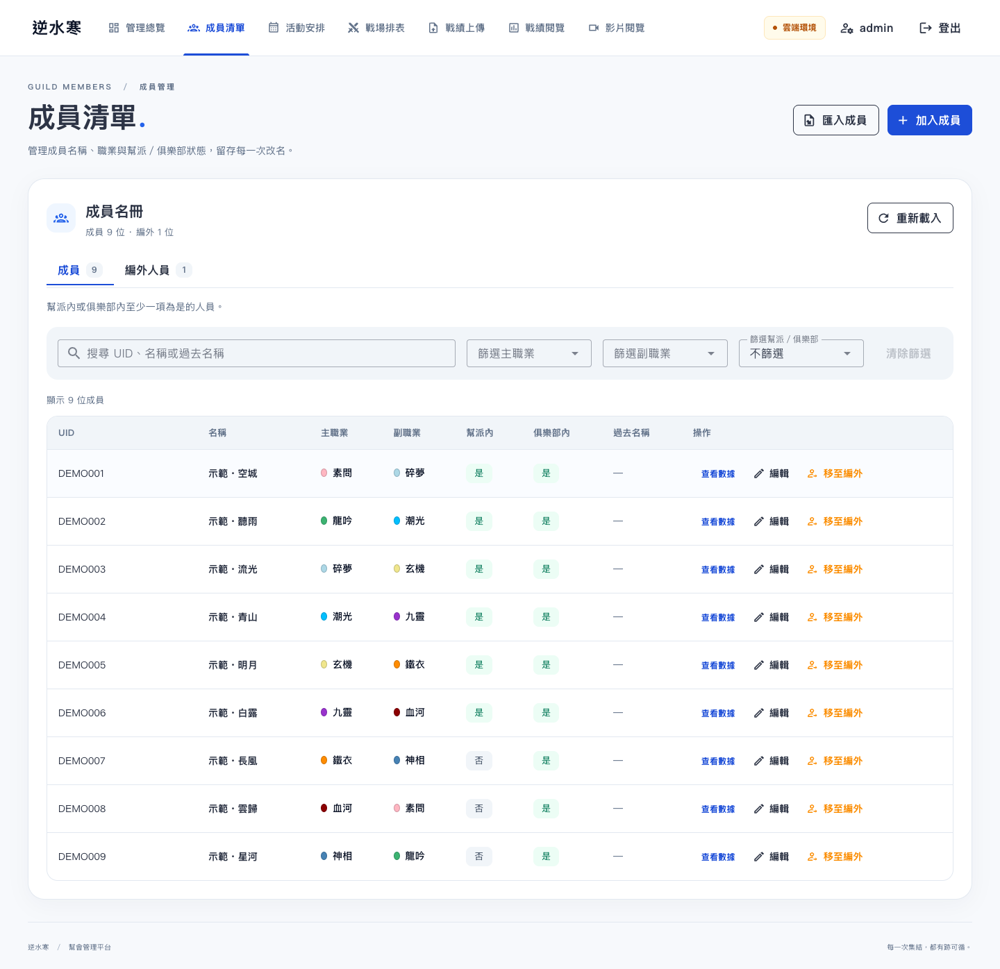

新增時按「加入成員」，填 UID、名稱、主職業、選填副職業與所屬狀態，按「儲存」。UID 是遊戲內 ID，建立後不能修改；請保留前導零。一般新增預設幫派內為是、俱樂部內為否，兼屬兩者時須自行勾選俱樂部。

新增成功後，系統會把尚未歸屬、名稱完全相同的歷史戰績連到新成員；目前名冊有同名多人時會跳過，已歸屬其他人的紀錄也不會轉移。按該列「查看數據」即可檢查關聯結果，必要時在個人頁按「重新載入」。這只建立戰績歸屬，不修改原始 CSV 或各場數值。

編輯時按該列「編輯」。修改名稱會保存過去名稱，可由清單的過去名稱入口查看；更換職業不產生改名紀錄。

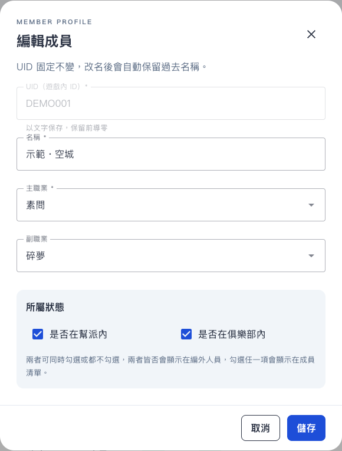

「移至編外」會把兩個所屬狀態設為否，保留角色資料及改名紀錄。回歸時到編外分頁編輯，勾選任一所屬狀態即可，不需重新建立 UID。

<a id="member-import"></a>
## 8. 批次匯入成員

1. 按「匯入成員」，貼上文字或讀取 UTF-8 的 CSV／TSV／TXT。
2. 欄位順序固定為 UID、Name、主職業、副職業。職業填中文名稱，沒有副職業可填 `-`。
3. 按「預覽資料」，確認新增、跳過及錯誤。
4. 無格式錯誤後按「確認匯入」，成功視窗會顯示結果。

```text
UID Name 主職業 副職業
000123 示範角色甲 素問 龍吟
000124 示範角色乙 碎夢 -
```

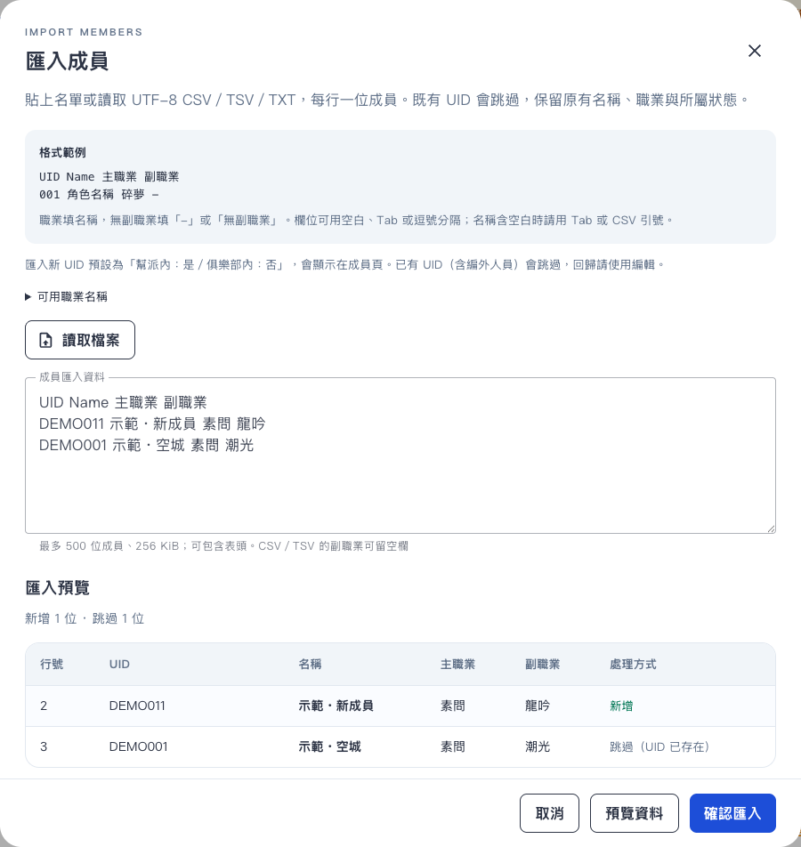

既有 UID（包含編外）只跳過，不改名、不覆寫職業或所屬狀態。同一批有格式錯誤或重複 UID 時，整批不匯入；先修正再預覽。新 UID 預設幫派內為是、俱樂部內為否，匯入後可逐筆調整。

CSV 匯入與單筆新增採相同的歷史戰績關聯規則：全部新成員建立後，依完整名冊判斷名稱是否唯一，再連到尚未歸屬的同名紀錄。因此，同批兩個不同 UID 使用相同名稱時，兩人可以匯入，但那些未歸屬的戰績不會自動分給任一人。匯入既有 UID 只跳過，不重新掃描其歷史戰績。

匯入完成後，回成員清單按「查看數據」確認；分析中的日期與職業使用戰績當時的資料，不會被這次匯入的職業覆寫。

<a id="events"></a>
## 9. 建立、修改與刪除活動

admin／manager 開啟「活動安排」→「建立安排」；也可從「管理總覽」月曆點日期，直接開啟並預選當天。

| 類型 | 名稱 | 建立時日期 | 保存結果 |
| --- | --- | --- | --- |
| 活動 | 必填 | 可選多天 | 一筆活動包含多天 |
| 約戰 | 必填 | 只能一天 | 一筆約戰 |
| 幫戰 | 可留空 | 可選多天 | 每天各自一筆場次 |
| 龍虎戰 | 可留空 | 可選多天 | 每天各自一筆場次 |

選類型、填名稱、點日期後按「儲存」。可以選不連續的日期；再點一次已選日期可取消。幫戰／龍虎戰留空名稱時，畫面以類型顯示，不需要事先知道對手。週期賽目前由管理者手動選日期建立。

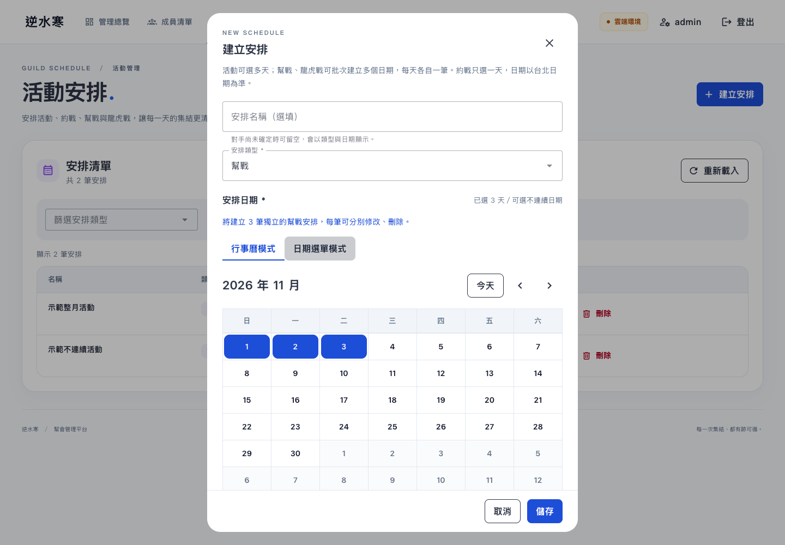

清單每列可「修改」或「刪除」。編輯幫戰／龍虎戰只修改這一筆的一天；刪除前確認名稱與受影響日期。一般活動多天同屬一筆，刪除會移除該筆全部日期。已保存的戰績不因活動刪除而消失，最後保存的排表會成為唯讀。

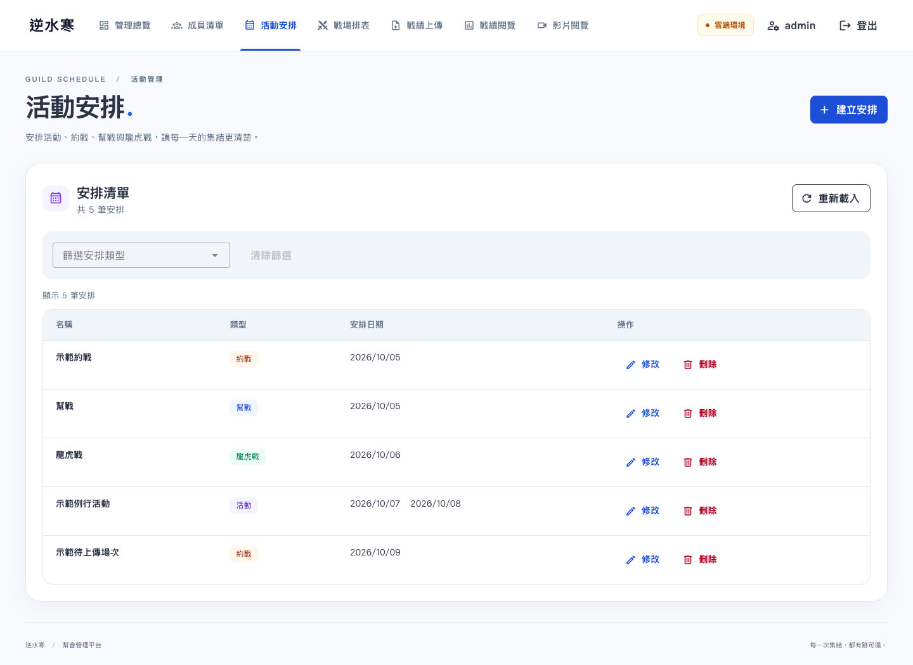

管理總覽的當日詳情會顯示戰鬥場次的報名／請假人數；首頁的玩家報名視窗只顯示報名人數。

### 出勤閱覽與取消請假

admin／manager 可從兩個位置查看當場名單：

1. 「管理總覽」點日期，再按該戰鬥場次的「出勤閱覽」。
2. 「活動安排」清單，按該場次操作欄的「出勤閱覽」。

一般活動沒有這個入口。視窗預設「請假（人數）」；幫戰、龍虎戰只顯示請假分頁，約戰另有「報名（人數）」分頁。人數依當場實際回應計算，包含名冊成員及外援，不把所有可排表成員都算成已報名；未回應或已解除請假的成員不列在這兩份名單。切換分頁可看名稱、當場職業與備註，玩家 UID 不會顯示。

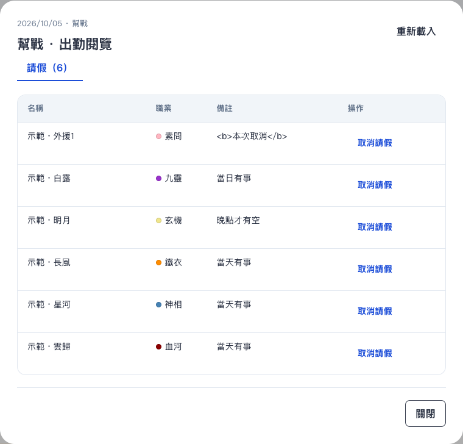

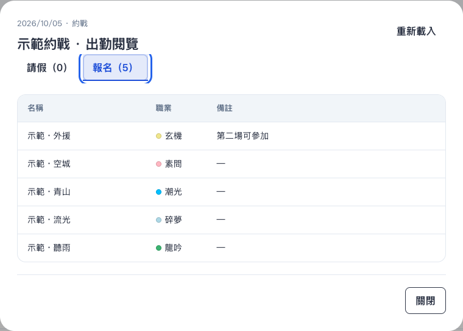

確定某人不需請假後，按該列「取消請假」。看到「已取消請假」後，名單會更新；幫會／俱樂部成員解除該場請假，回到可排表來源，所屬身分不變，也不會新增為編外人員。外援的請假代表取消報名，撤銷請假會恢復他的原報名。已有排表時，重新載入來源名單後再安排人員。

成員自行在首頁把狀態改為「報名」並送出，同樣會解除該場請假，保持原幫會／俱樂部身分。若取消操作提示資料已更新，先按「重新載入」確認最新狀態，再操作；不要把舊畫面的人數當成送出成功。

<a id="lineups"></a>
## 10. 安排戰場名單

1. 開啟「戰場排表」，先選「戰鬥場次」。
2. 左側「成員」中切換幫會成員／俱樂部成員／額外報名，也可搜尋或篩選職業。
3. 成員有副職業時，可先按卡片右下「主／副」，設定這次安排的職業。
4. 把卡片拖到右側位置，或先點成員，再點位置。

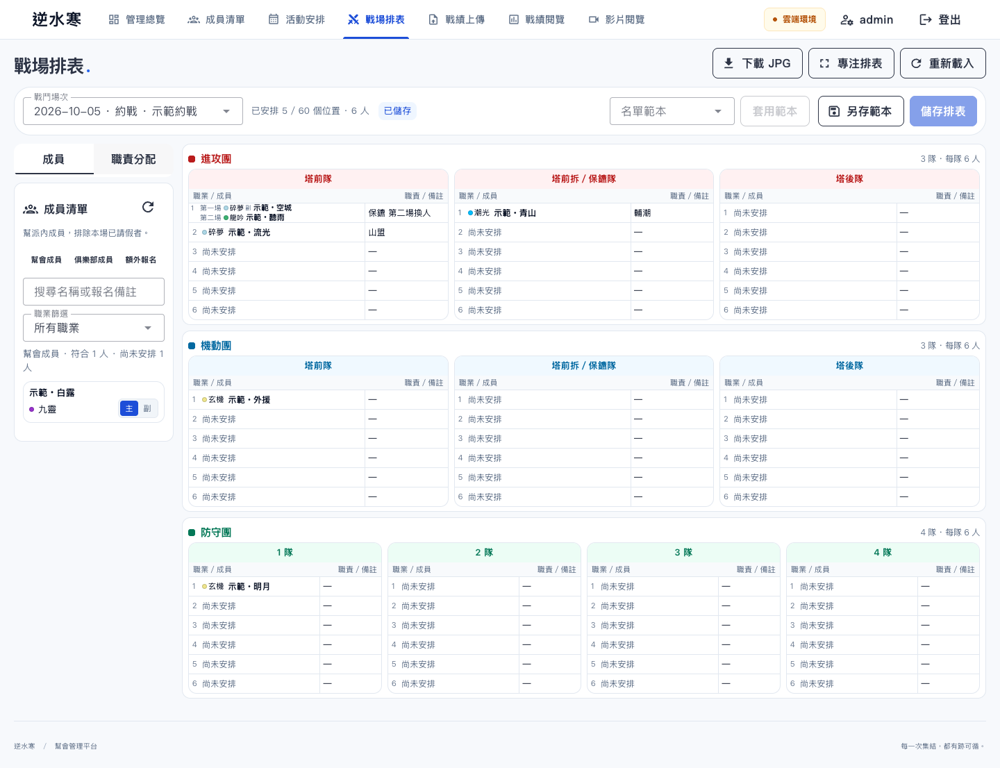

三種戰鬥共用進攻 3 隊、機動 3 隊、防守 4 隊，每隊 6 個位置。不必填滿才能儲存。

幫會分頁顯示幫派成員；俱樂部分頁顯示俱樂部且非幫派成員，避免兼屬者重複。額外報名包含本場外援及已報名的編外人員。本場請假的人不在可用來源。任一場已安排的人會從左側隱藏，完全移出後才恢復。

額外報名分頁提供「代為報名」，填名稱、職業及選填備註，成功後即可安排，不會加入正式名冊。

<a id="lineup-position"></a>
## 11. 雙場換人、職責與備註

把另一人放到已有人的位置，該位置會分成第一場／第二場，最多兩人。同一人不能重複安排到多個位置；沒有指定第二場人員時，沿用第一場。

點位置可編輯兩場人員、各自上場職業、職責與共用備註。要移除或交換已安排的人，也從位置編輯。完成後按視窗的確認按鈕套入目前排表，接著仍須「儲存排表」才保存。

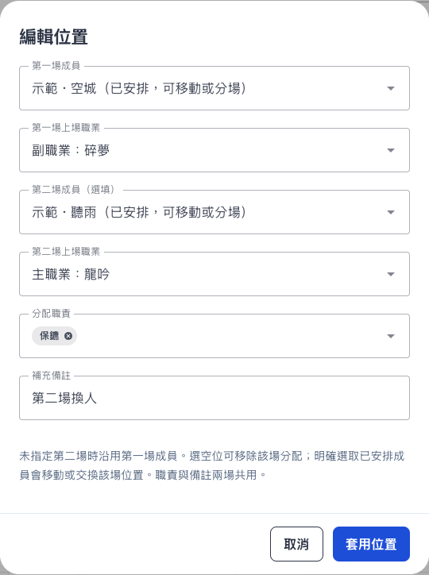

左側切到「職責分配」，把保鑣、山盟、輔潮等職責拖到位置，或先選職責再點位置。每個位置可有多項職責，同一職責可給多人。職責及備註屬於位置，搬動人員不會一起搬走。

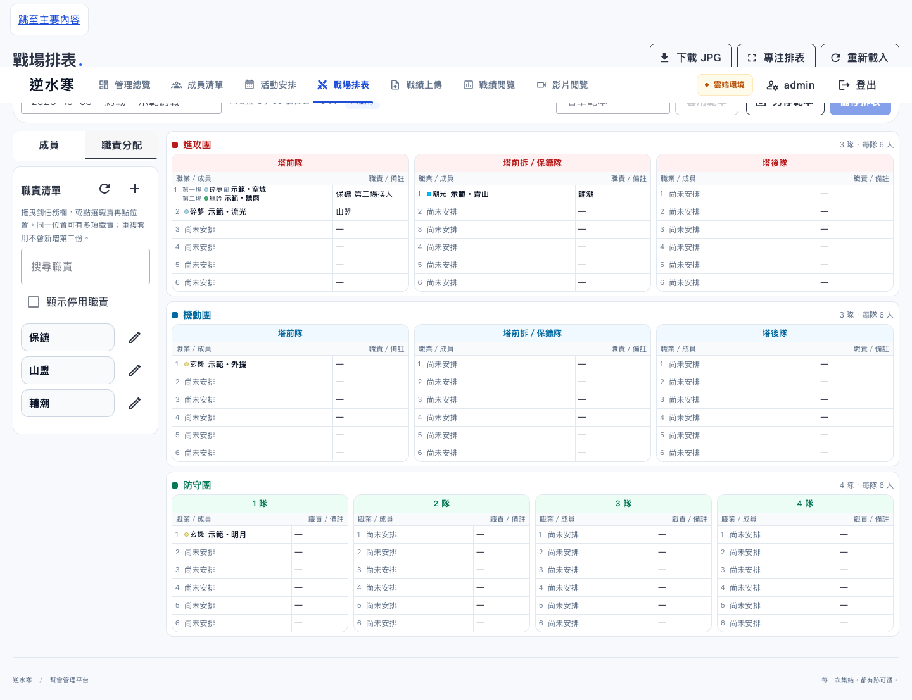

職責區可維護新增、改名或停用／啟用；既有已保存快照保留當時名稱。

<a id="lineup-save"></a>
## 12. 排表儲存、範本與 JPG

- **儲存排表**：保存目前場次的排表，保存後仍可編輯。看到「已儲存」才表示完成；未保存離開會提醒。
- **另存範本**：輸入範本名稱，保留目前配置供其他場次重用。要保留舊配置時，先另存範本再修改。
- **套用範本**：選「名單範本」→「套用範本」，檢查跳過提示並調整，再儲存。請假、不合資格、其他場次外援或停用職責可能被跳過。
- **下載 JPG**：下載完整三團十隊的排表圖片，可貼到 Discord。「專注排表」會收起部分畫面，方便安排。

JPG 包含場次、職業、姓名、職責與備註，沒有 UID 或左側選單。下載使用目前畫面資料，未保存的修改也會出現在圖片，**下載不等於儲存**。場次已刪除或改為一般活動時，排表唯讀，仍可另存範本及下載 JPG。

<a id="battle-upload"></a>
## 13. 上傳戰績 CSV

admin／manager 開啟「戰績上傳」，先選已建立的戰鬥場次，日期與類型沿用活動安排。

1. 約戰／幫戰可放第一場與第二場，龍虎戰只有單場；每場選擇或拖入一個 UTF-8 CSV，最多 1 MB。
2. 確認解析出的人數、紅方及藍方名稱。隊名可調整。
3. 「我方是哪邊」「獲勝方」均選填。約戰每場各有「是否為內推」開關，內推時不填敵我與勝敗。
4. 下方「戰績資料」切第一場／第二場檢查玩家表格。
5. 捲至底部，按「上傳第一場」「上傳第二場」獨立送出，或「上傳戰績」一起送出全部待上傳 CSV。

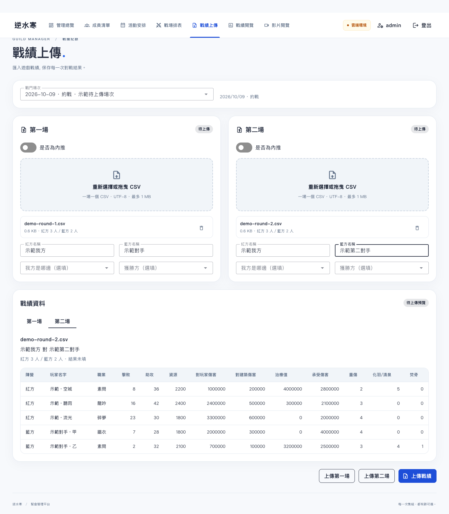

幫戰單場週只放一場；雙場週可各填不同對手。CSV 的第一段玩家表是紅方、第二段是藍方，系統不依傷害或玩家名稱推測我方與勝方。成功會顯示保存筆數；已上傳的場次不能在此直接覆寫，下方表格可查看保存資料並下載原始 CSV。單獨上傳一場不會清除另一場草稿。

影片連結與戰績 CSV 是兩種功能：影片由首頁場次視窗提交，CSV 由管理端戰績上傳提交。

<a id="battle-view"></a>
## 14. 戰績清單與對戰詳情

member／manager／admin 均可開啟「戰績閱覽」。點清單中的對戰名稱進入詳情，每頁 20 筆，從詳情可返回清單。

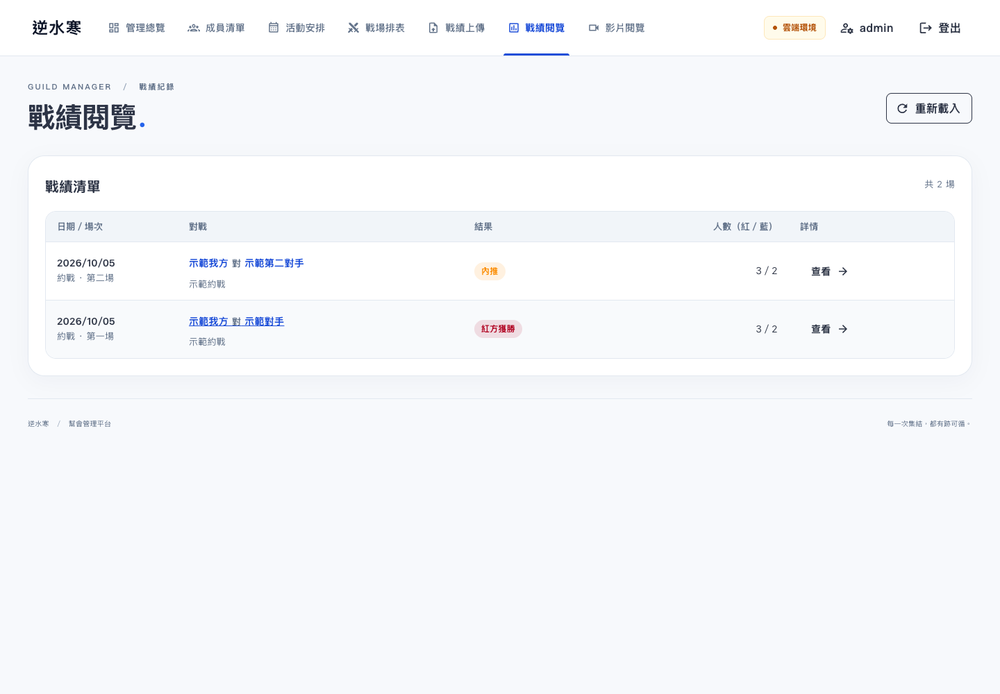

詳情上方顯示雙方、日期、場序、結果、人數及職業分布，並比較十項合計。紅方靠左、藍方靠右，中間箭頭指向數值較高的一方；箭頭只比較數值，不代表獲勝。結果未填或內推會保留原標示。

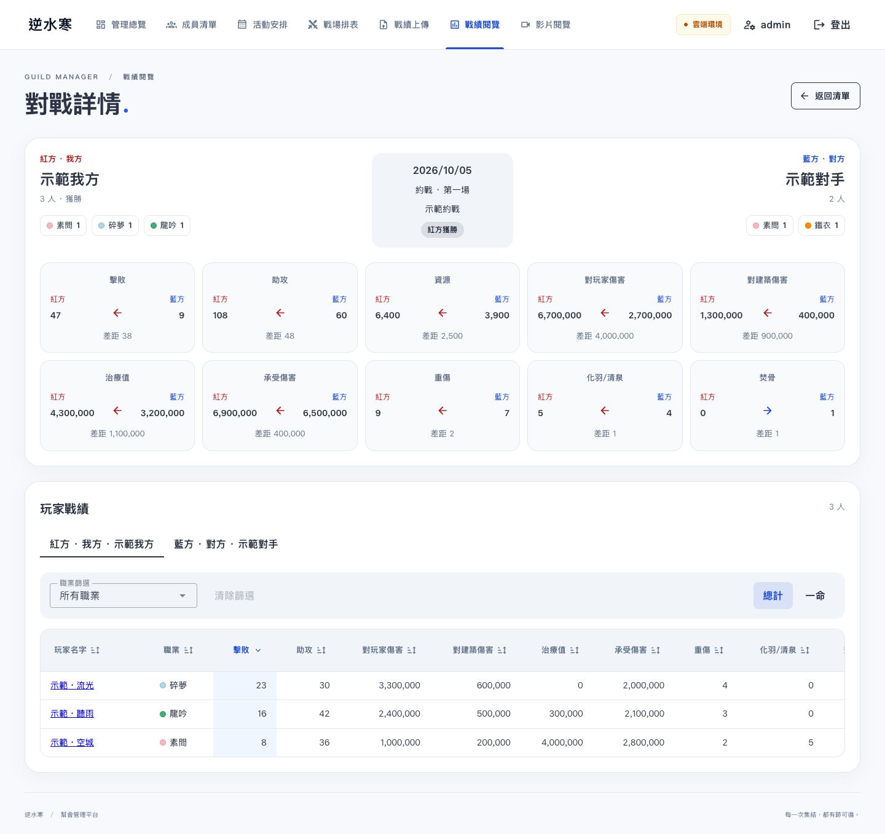

下方玩家表格：

1. 切「紅方／藍方」查看對應陣營。
2. 用「職業篩選」只看特定職業。
3. 點欄名升冪／降冪排序，排序涵蓋符合條件的全部資料後才分頁。
4. 切「總計／一命」。一命貢獻＝該欄總值 ÷ max（重傷次數，1），重傷仍顯示原次數。資源欄在最右側，窄螢幕可左右捲動。

這一頁的職業篩選只影響下方玩家表格，上方雙方統計仍是整場資料；個人分析頁的篩選則會同時更新統計與明細。

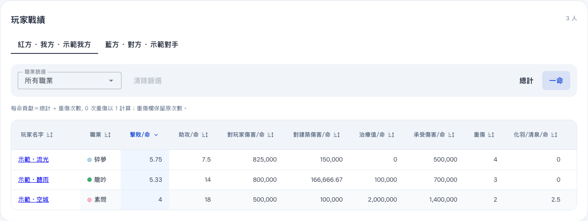

缺值顯示「—」，部分缺值會標示部分資料；缺值不代表零。名稱有連結時可查看該成員個人戰績。

<a id="personal"></a>
## 15. 個人戰績分析

從對戰表格點已關聯的角色名稱；admin／manager 也可從成員清單按「查看數據」。member 可查看分析，但不能因此進入成員管理頁。

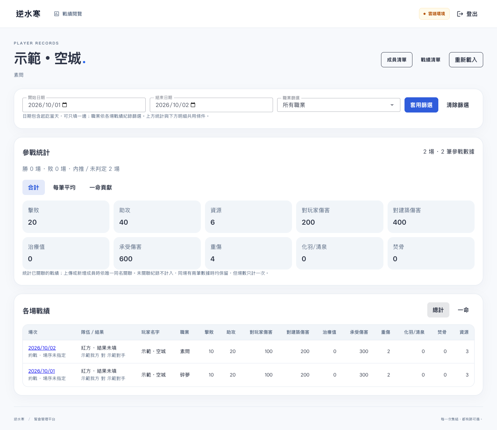

### 日期與職業篩選

1. 設定「開始日期」及「結束日期」，也可只填其中一邊，兩邊都留空表示不限日期。日期包含起訖當天，結束日期不能早於開始日期。
2. 選「職業篩選」，或保留「所有職業」。選項來自這位成員的歷史戰績，按各場當時的職業比對，不是目前名冊的主／副職業。
3. 按「套用篩選」，等待資料載入；單純修改欄位尚未套用。上方參戰統計與下方各場明細會一起使用新條件。
4. 按「清除篩選」恢復全部紀錄。套用或清除條件都回到第一頁。

例如，開始日期為 2026/10/01、結束日期為 2026/10/02，再選「碎夢」，只保留這兩天以碎夢參戰的紀錄。圖 23 是兩天的全部職業，圖 24 套用碎夢後只剩一場；頁首目前主職業顯示素問不影響這個結果。

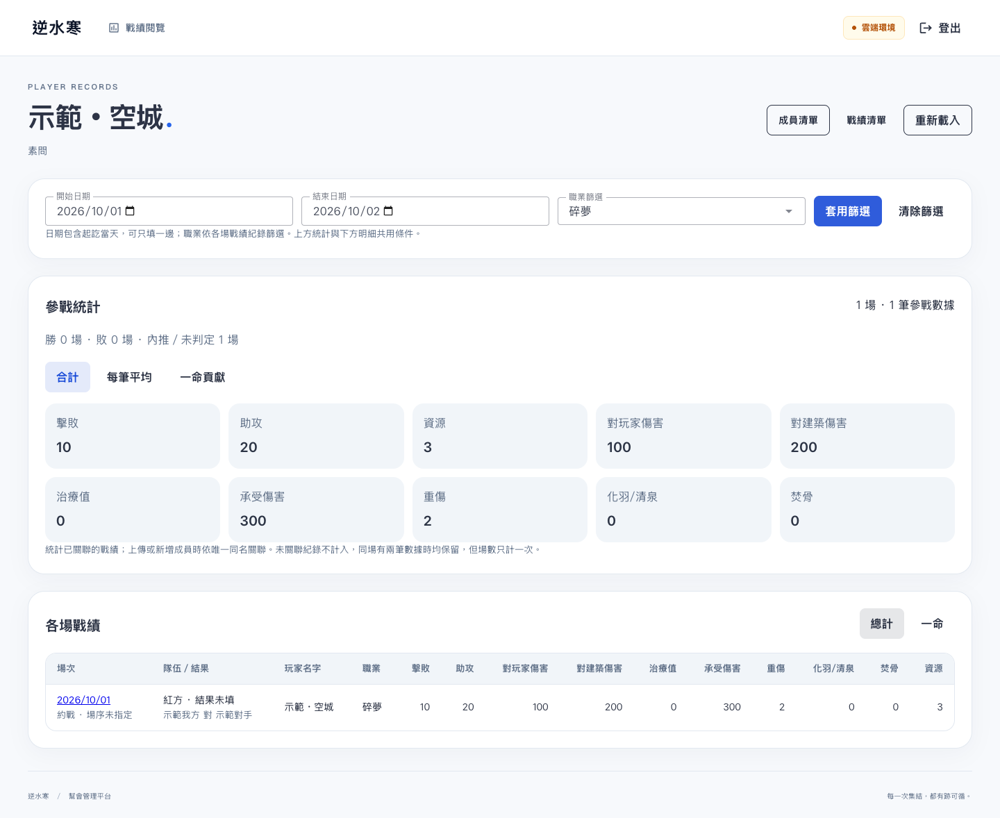

沒有符合資料時會顯示「沒有符合篩選條件的戰績」；可調整日期、改成所有職業或清除篩選。錯誤提示出現時，先修正欄位，再按套用。

### 統計與各場明細

上方可切換「合計」「每筆平均」「一命貢獻」，下方可切「總計／一命」並點日期返回對戰詳情。每筆平均只計有數值的紀錄；一命貢獻以有該項數值及重傷的紀錄計算，各筆至少算一命。缺值顯示「—」，不當成零。

內推或結果未填不算勝敗，歸在未判定。個人合計涵蓋所有符合篩選條件的已關聯紀錄，不只目前分頁；同場有兩筆個人數據時保留兩筆，場數只計一次。

### 為什麼有些舊戰績沒有計入

戰績上傳或新增成員時，依完全相同且唯一的名稱建立關聯；單筆新增與 CSV 匯入的新成員都適用。同名多人、不同名稱或已歸屬其他人的紀錄不會轉移。既有 UID 匯入、改名或重新啟動不重新歸屬，也不會把過去名稱的全部紀錄自動認領。

因此，個人場數可能少於實際上場次數。先按「清除篩選」查看全部已關聯資料，再確認戰績中的名字是否與新增時一致；對戰詳情中沒有連結的名字代表該筆尚未關聯。

<a id="admin"></a>
## 16. admin 帳號與平台設定

僅 admin 可進入「帳號管理」：桌面點右上角帶設定圖示的 admin 帳號按鈕，手機也可由導覽選單進入。下列操作都在對應分頁完成。

### 平台設定

修改「平台名稱」後按「儲存設定」，名稱最多 30 字，頂欄、頁尾及網頁標題會同步更新。圖示可選 PNG／JPEG／WebP，最多 256 KB，可預覽、移除或還原；選完須按儲存才生效。不設定圖示時只顯示名稱。

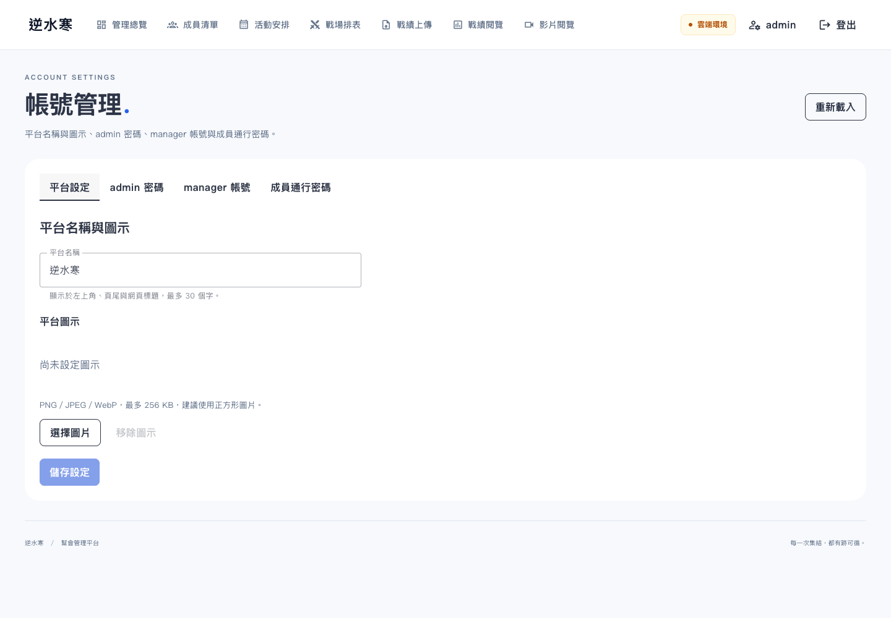

### manager 帳號

按「建立 manager」，填帳號、12–128 字元密碼及確認密碼，按「儲存」。修改既有帳號時按該列「修改」，新密碼留空表示保留原密碼。manager 可用管理功能，但不能進入帳號管理。

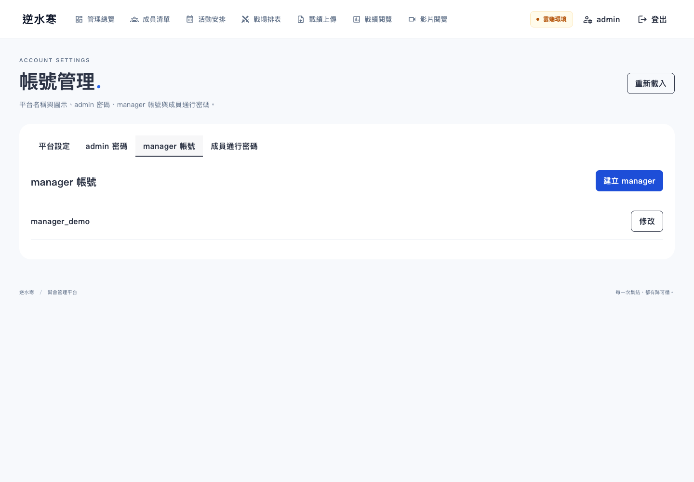

### 成員通行密碼

設定或更新共用通行密碼及確認欄後送出。通行密碼為 6–128 個英文字母或數字，區分大小寫，純數字也可使用。更新後既有 member 登入會失效，需以新密碼重新登入；請自行通知成員。

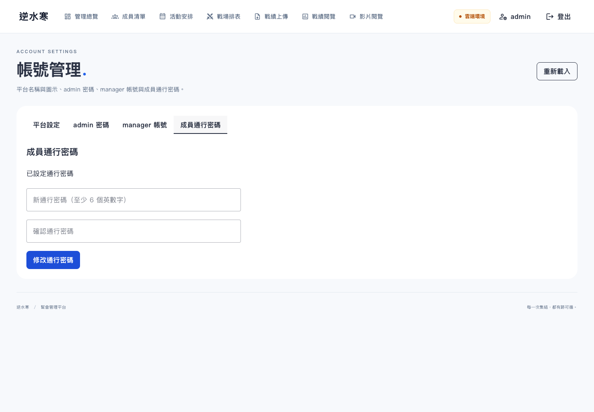

### admin 密碼

填目前密碼、新密碼及確認新密碼，按「修改密碼」。新密碼為 12–128 字元；保存後請自行保管，不會顯示已保存密碼。

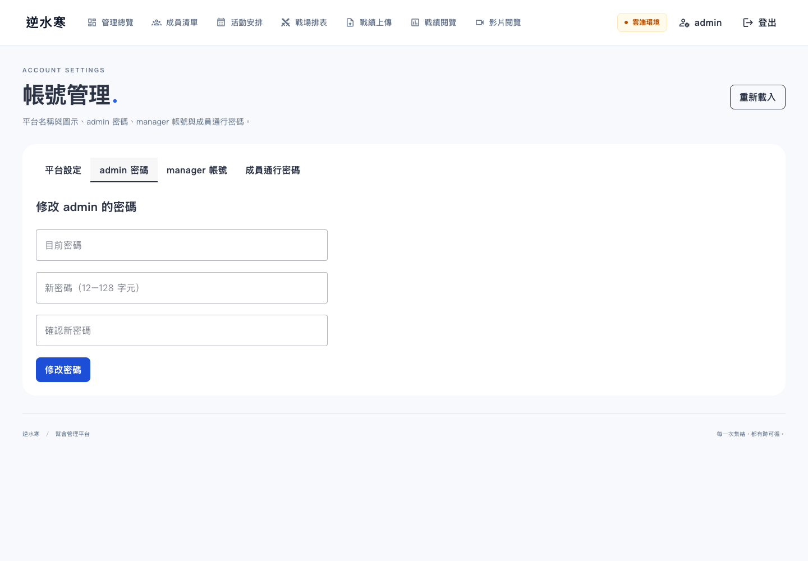

<a id="mobile"></a>
## 17. 手機操作

右上選單開啟你有權限的功能。點左上名稱返回行事曆。寬表格在表格容器內左右滑動，查看靠右欄位；視窗可上下捲動。

排表在手機可用「點成員→點位置」操作，不必拖曳。影片連結可長按選取複製。CSV 與 JPG 由瀏覽器下載，下載位置依你的手機與瀏覽器設定而異。

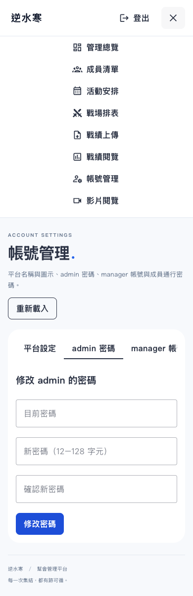

<a id="faq"></a>
## 18. 常見問題

| 情況 | 處理方式 |
| --- | --- |
| 看不到幫戰、龍虎戰 | 先由右上角成員登入；登入已過期或通行密碼已更改時，重新登入。 |
| 找不到管理入口或影片清單 | member 只有成員功能；管理操作使用 manager／admin，帳號管理只限 admin。 |
| 請假顯示「沒有報名或沒有資料」 | 確認原報名名稱、場次及名冊；外援需先有本場報名。 |
| 成員請假後改為報名，是否變成編外？ | 不會。解除的是本場請假，幫會／俱樂部身分維持名冊設定；管理者也可在出勤閱覽按取消請假。 |
| 送出失敗或顯示資料已修改 | 輸入會保留。依提示重新載入，確認場次／名冊更新後再送出。 |
| 已安排的人從左側消失 | 這是正常行為。由右側位置編輯，全部移出後才回到來源名單。 |
| 排表看得到但不能修改 | 原場次已刪除或改成一般活動，最後保存排表已封存。 |
| 影片兩場都空白不能送出 | 至少填一個完整影片網址，再選團別。 |
| 匯出 CSV 按鈕不能按 | 清單仍在載入、讀取失敗或篩選後沒有資料；先載入或清除篩選。 |
| 上傳戰績找不到送出按鈕 | 在玩家預覽表格下方，捲到頁面底部。 |
| 新增成員後還是沒有舊戰績 | 清除個人分析篩選並重新載入；核對戰績名字是否完全相同、名冊是否同名多人，或紀錄是否已歸屬他人。既有 UID 匯入及改名不會觸發回填。 |
| 個人頁選職業後沒有資料 | 這是當場職業篩選。改成所有職業、放寬日期，或按清除篩選；只修改欄位後須再按套用篩選。 |
| 日期顯示「結束日期不得早於開始日期」 | 修正起訖順序；也可只填開始或結束日期，再按套用篩選。 |
| GAS 網址還是舊版畫面 | 程式上傳後，部署者須更新既有 Web App 的部署版本；詳見專案 GASDeployment.md。 |
| admin 忘記密碼 | 聯絡 Apps Script 部署者，依 GASDeployment.md 的 admin 登入復原步驟處理。AUTH_SECRET 不是登入密碼。 |

使用本手冊時，操作成功以畫面成功提示為準；選檔、拖入排表、預覽或下載本身不代表已保存。若看見尚未保存／未送出提示，先確認再離開。
